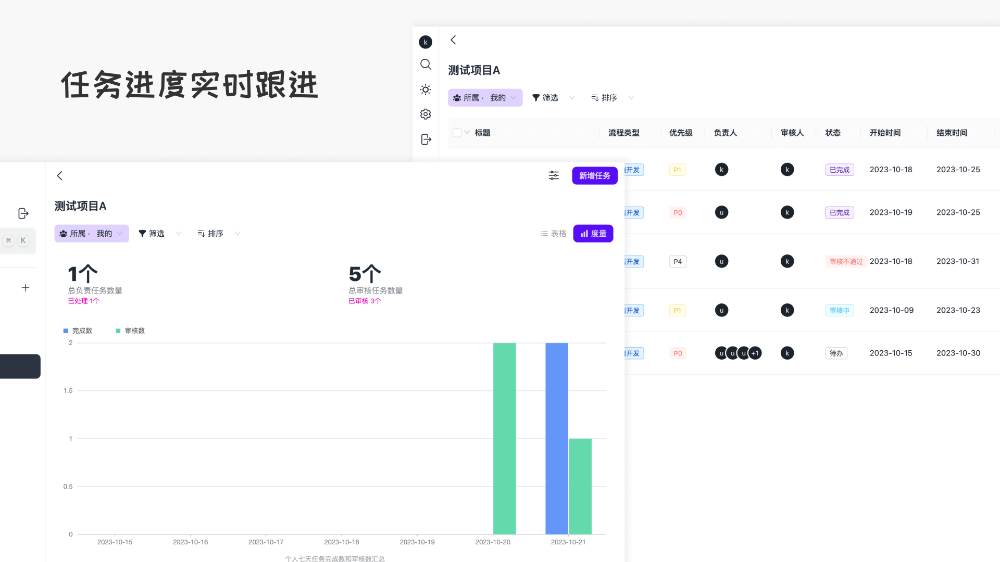
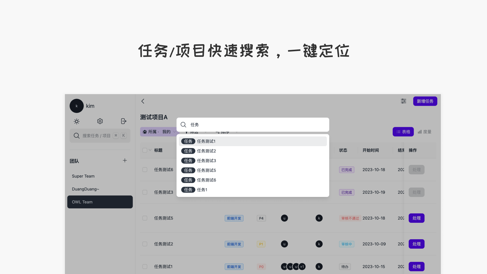

# Do Tasks

一款基于web 的**团队任务协同**工具。

> 💾 **服务端**：[do tasks server](https://github.com/leezhian/do-tasks-server)






## ✨ 特性

- 🌈 基于 Tailwind CSS  响应式设计（主[daisyUI](https://github.com/saadeghi/daisyui)，次[ant design 5](https://github.com/ant-design/ant-design)），极简扁平风格
- 🌓 浅色/深色模式随意切换
- 🖥️ 无需安装，基于浏览器搭建


## 🔨 技术栈

**建议 Node 版本14.18+**

- React + TypeScript + zustand + Vite
- Tailwind CSS + daisyUI + ant design 5
- framer-motion 动画效果实现
- 其他依赖 ahooks、lodash、TinyMCE等


> Ant Design 主要用到的是它的 RangePicker 和部分表单组件，原本打算自己复刻的，但由于时间原因临时使用它（不可否认 Ant Design 是一个很优秀的 UI 组件库）。PS：有时间的话我会改掉它🧑‍💻
>
> *这个项目主要用于我的毕设，因为写的有点冲忙，有部分设计的不太合理*。


## 📦 安装

```bash
pnpm install
pnpm dev
# browser open http://localhost:5173/
```


**构建部署**

```bash
pnpm build
```

*TODO 补充自动部署*


## 📋 待办事项

- [ ] Modal 组件处理优化
- [ ] 移除 Antd 库
- [ ] 动画完善
- [ ] 支持自动化部署


## 📌 已知问题记录

1. 添加 or 修改数据后本地数据未刷新
2. 归档后项目仍允许编辑（期望是不允许的）
3. 搜索跳转优化
4. 消息功能不全
